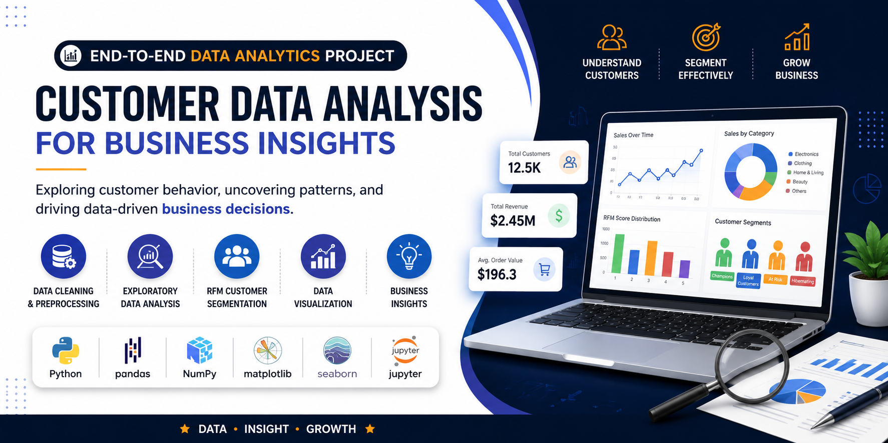
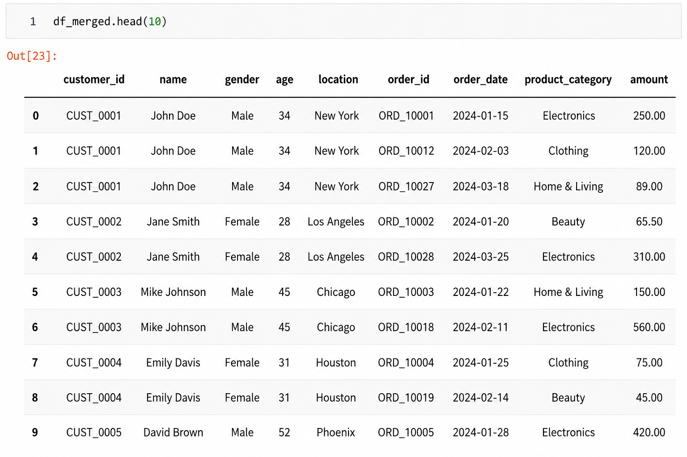

# 📊 Customer Data Analysis for Business Insights

<p align="center">
  
</p>


---

## 📌 Project Overview

This project analyzes customer and transaction data for a retail business to uncover meaningful business insights. Using Python and data analytics techniques, the project cleans and processes raw data, performs Exploratory Data Analysis (EDA), segments customers using RFM Analysis, and generates actionable recommendations to improve customer retention and business growth.

---

## 🎯 Objectives

- Clean and preprocess customer data
- Merge customer and transaction datasets
- Perform Exploratory Data Analysis (EDA)
- Identify customer purchasing patterns
- Segment customers using RFM Analysis
- Generate actionable business insights

---

## 🛠️ Tech Stack

- Python
- Pandas
- NumPy
- Matplotlib
- Seaborn
- Jupyter Notebook

---

## 📂 Dataset

The project uses two datasets:

- **Customer_Master_Data.csv**
- **Customer_Transactions.csv**

After preprocessing, both datasets are merged into a unified dataset for customer-level analysis.

---

# 📈 Project Workflow

```text
Customer Data
       │
       ▼
Data Cleaning
       │
       ▼
Data Preprocessing
       │
       ▼
Merge Datasets
       │
       ▼
Exploratory Data Analysis
       │
       ▼
RFM Customer Segmentation
       │
       ▼
Business Insights
       │
       ▼
Recommendations
```

---

## 📊 Project Output

<p align="center">

</p>

---

## 🔍 Exploratory Data Analysis

The notebook includes analysis of:

- Customer demographics
- Transaction trends
- Revenue analysis
- Purchase frequency
- Customer spending
- Product category analysis
- Customer behavior patterns

---

## 👥 RFM Customer Segmentation

Customers are segmented based on:

- **Recency**
- **Frequency**
- **Monetary Value**

This helps identify:

- 🏆 Champions
- 💎 Loyal Customers
- ⭐ Potential Loyalists
- ⚠️ At Risk Customers
- ❌ Hibernating Customers

---

## 💡 Business Insights

- Identify high-value customers
- Understand customer purchasing behavior
- Improve customer retention
- Increase business revenue
- Enable targeted marketing campaigns
- Support data-driven business decisions

---

## 📁 Project Structure

```text
Customer-Data-Analysis-for-Business-Insights/
│
├── data/
│   ├── Customer_Master_Data.csv
│   └── Customer_Transactions.csv
│
├── images/
│   ├── banner.png
│   └── output1.png
│
├── notebook/
│   └── project.ipynb
│
├── reports/
│   ├── notebook.html
│   └── project_report.pdf
│
├── README.md
├── requirements.txt
├── LICENSE
└── .gitignore
```

---

## 🚀 Getting Started

Clone the repository

```bash
git clone https://github.com/knoxwave/Customer-Data-Analysis-for-Business-Insights-Python-Pandas.git
```

Install dependencies

```bash
pip install -r requirements.txt
```

Launch Jupyter Notebook

```bash
jupyter notebook
```

Open

```
project.ipynb
```

---

## 📌 Key Features

- Data Cleaning
- Data Preprocessing
- Exploratory Data Analysis
- Customer Analytics
- RFM Analysis
- Business Intelligence
- Data Visualization
- Customer Segmentation

---

## 📄 Project Report

The repository includes:

- 📘 Jupyter Notebook
- 📄 Detailed PDF Report
- 🌐 HTML Notebook Export

---

## 📈 Future Improvements

- Build an interactive Power BI dashboard
- Develop customer churn prediction models
- Create sales forecasting models
- Deploy the project as a Streamlit web application

---

## 👨‍💻 Author

**Ajit Kumar**

Data Analyst | Python | SQL | Power BI | Excel

Portfolio : https://ajit.msgjob.in/

GitHub: https://github.com/knoxwave

LinkedIn: https://www.linkedin.com/in/ajit-kumar-950039128/

---

## ⭐ If you found this project useful, don't forget to star the repository!
